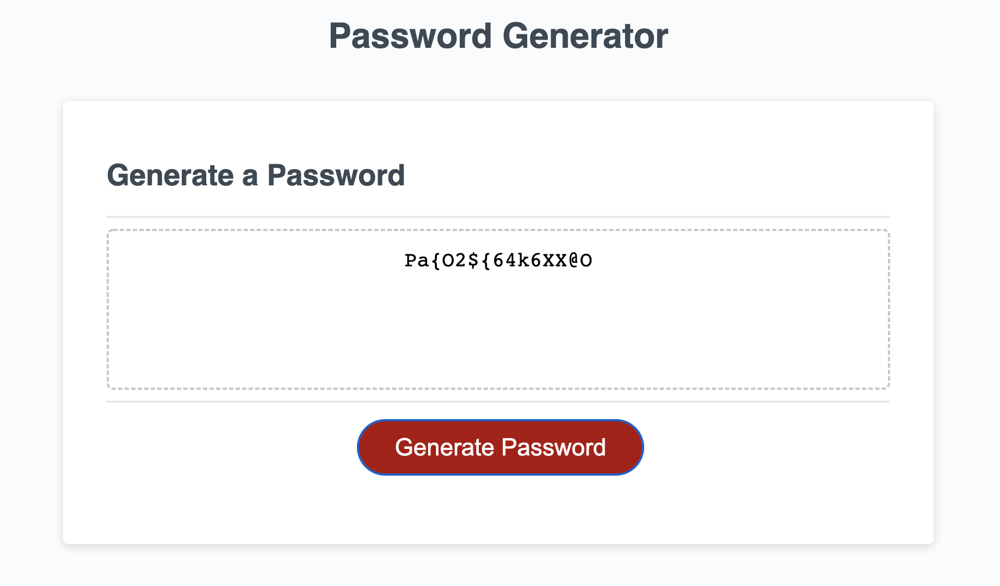
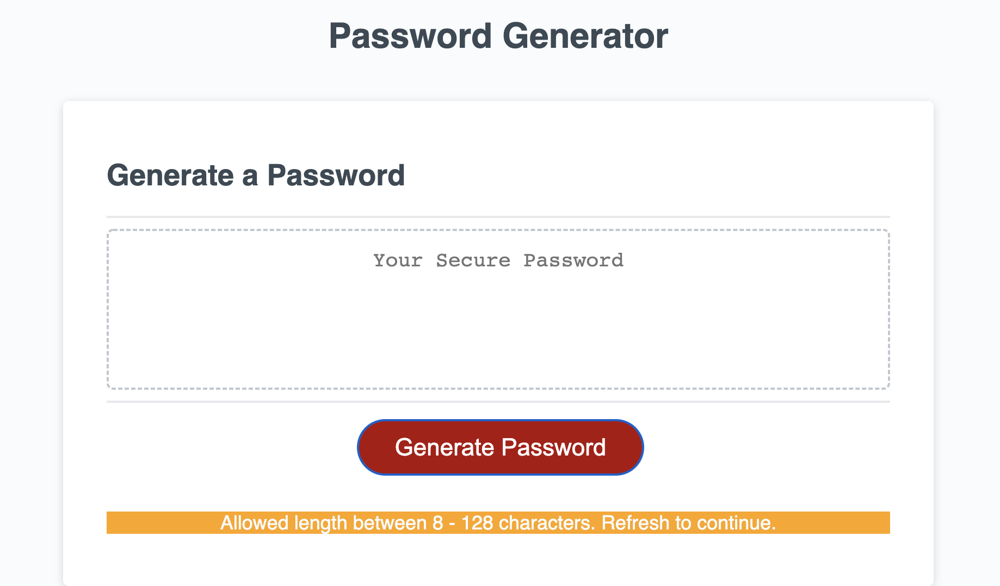

# [JavaScript Password Generator](https://rkutsel.github.io/js-password-generator/)

## Description

This repository holds week III homework assignment for [JavaScript Password Generator app](https://rkutsel.github.io/js-password-generator/). The main function that generates random passwords relies on user input and covers a few edge cases. 
Additionally, I added JS alerts for the edge cases that result in a popup window with an error message along with additional information generated on the page to help the user make corrective actions. The JS code has comments with descriptive changes. 


## User Story

```
AS AN employee with access to sensitive data
I WANT to randomly generate a password that meets certain criteria
SO THAT I can create a strong password that provides greater security
```

## Acceptance Criteria

```
GIVEN I need a new, secure password
WHEN I click the button to generate a password
THEN I am presented with a series of prompts for password criteria
WHEN prompted for password criteria
THEN I select which criteria to include in the password
WHEN prompted for the length of the password
THEN I choose a length of at least 8 characters and no more than 128 characters
WHEN asked for character types to include in the password
THEN I confirm whether or not to include lowercase, uppercase, numeric, and/or special characters
WHEN I answer each prompt
THEN my input should be validated and at least one character type should be selected
WHEN all prompts are answered
THEN a password is generated that matches the selected criteria
WHEN the password is generated
THEN the password is either displayed in an alert or written to the page
```

## Mock-Up

The below image shows the web application's appearance and functionality:




